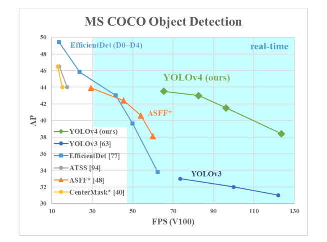
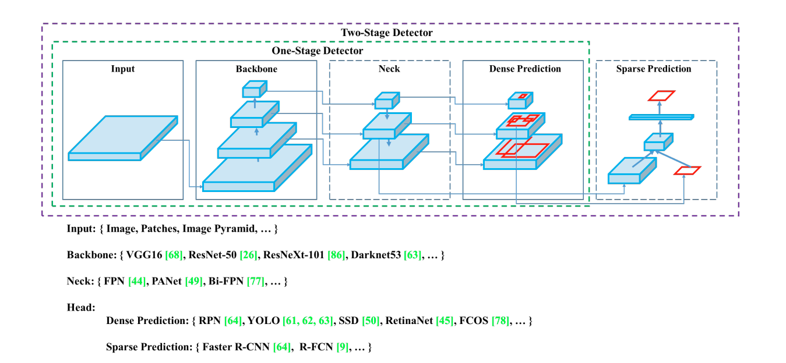

# YOLO V4 from Scratch

<p align="center">
  
</p>

<p align="center">
  <em>Overview of the YOLO V1 object detection approach.</em>
</p>

<p align="center">
  
</p>

<p align="center">
  <em>YOLO V1 model architecture and layer structure.</em>
</p>

A PyTorch implementation of **YOLOv4**, built from the ground up, following the original paper ["YOLOv4: Optimal Speed and Accuracy of Object Detection"](https://arxiv.org/abs/2004.10934) by Alexey Bochkovskiy, Chien-Yao Wang, and Hong-Yuan Mark Liao.

This repository provides a complete, modular implementation including data loading, model architecture (CSPDarknet53 with an SPP + PANet multi-scale head), a custom multi-scale loss function with CIoU box regression, a training pipeline with multi-scale training, and evaluation metrics.

---

## 📋 Table of Contents

- [✨ Features](#-features)
- [📁 Project Structure](#-project-structure)
- [🚀 Installation](#-installation)
  - [Prerequisites](#prerequisites)
  - [Setup](#setup)
- [📊 Dataset Preparation](#-dataset-preparation)
- [⚙️ Configuration](#️-configuration)
- [🏃 Usage](#-usage)
  - [Training](#training)
  - [Command Line Arguments](#command-line-arguments)
  - [Available Arguments](#available-arguments)
- [🧠 Model Architecture](#-model-architecture)
  - [CSPDarknet53 Backbone](#cspdarknet53-backbone)
  - [SPP + PANet Neck](#spp--panet-neck)
  - [Anchor Boxes](#anchor-boxes)
  - [Output Shape](#output-shape)
- [📉 Loss Function](#-loss-function)
- [📊 Evaluation Metrics](#-evaluation-metrics)
  - [mAP Calculation](#map-calculation)
- [📈 Results](#-results)
- [📝 License](#-license)

---

## ✨ Features

- **Complete YOLOv4 implementation** from scratch using PyTorch
- **CSPDarknet53 backbone**: Darknet53's residual stages rewired with Cross-Stage-Partial (CSP) connections, using Mish activation instead of LeakyReLU
- **SPP (Spatial Pyramid Pooling)** block after the backbone, enlarging the receptive field cheaply via multi-kernel max-pooling
- **PANet neck**: a top-down (FPN-style) path *plus* a bottom-up path back up through the scales, so features flow both ways before detection
- **Multi-scale prediction**: detects at 3 grid resolutions simultaneously (13×13, 26×26, 52×52 for a 416px input)
- **9 anchor boxes** (3 per scale) instead of a single anchor set
- **CIoU loss** for box regression — a single similarity score combining overlap, center-distance, and aspect-ratio consistency, instead of 4 independent squared-error terms
- **Independent per-class logistic classifiers** (binary cross-entropy) instead of softmax, so multi-label predictions are possible
- **Multi-Scale Training** (320–608px) for robust performance across resolutions
- **Custom dataset loader** for PASCAL VOC format with label parsing
- **Mean Average Precision (mAP)** evaluation metric
- **Non-Maximum Suppression (NMS)** for post-processing, applied across all 3 scales' detections together
- **Flexible configuration** via YAML files and command-line arguments
- **Checkpoint saving/loading** for resuming training
- **Visualization utilities** for bounding boxes

---

## 📁 Project Structure

```
YOLO_V4_from_sratch/
├── configs/
│   └── train_config.yaml          # Configuration file for training
├── loss_f.py                      # YOLOv4 multi-scale loss function (CIoU + BCE)
├── main.py                        # Training script entry point
├── model.py                       # YOLO V4 CSPDarknet53 + SPP + PANet head
├── utils.py                       # Utilities (IoU, NMS, mAP, target building, multi-scale, checkpointing)
├── intersection_Over_Union.py     # IoU calculation
└── dataset.py                     # dataset class for VOCDataset
```

---

## 🚀 Installation

### Prerequisites
- Python 3.8+
- PyTorch 1.9+
- CUDA-capable GPU (recommended — CSPDarknet53 + SPP + PANet is noticeably heavier than YOLOv2/v3's backbones; expect roughly double the activation memory of the YOLOv3 version of this repo at the same input size and batch size)

### Setup

1. Clone the repository:
```bash
git clone https://github.com/ms20237/Vision_Projects.git
cd Vision_Projects/YOLO_V4_from_sratch
```

2. Install dependencies:
```bash
pip install torch torchvision pandas pillow matplotlib numpy pyyaml tqdm
```

---

## 📊 Dataset Preparation

This implementation expects the PASCAL VOC dataset format. Prepare your dataset as follows:

1. **Directory structure:**
```
data/
├── images/                        # Training images
│   └── 000001.jpg
├── labels/                        # Label files (.txt)
│   └── 000001.txt
└── test/                          # Test images (optional)
    └── 000001.jpg
```

2. **Label format** (per line): `class_id x_center y_center width height`
   - Normalized coordinates (0-1)
   - Example: `0 0.5 0.5 0.2 0.3`

3. **Create CSV files** for training and testing:
   - Use `generate_csv.py` to create annotation CSV files
   - The CSV should have columns: `image_path, label_path`

> **Note on targets:** Same convention as the YOLOv3 version of this repo. Unlike a single-scale YOLO, `VOCDataset.__getitem__` should return `(image_tensor, boxes)` where `boxes` is a plain list of `(class_idx, x, y, w, h)` tuples in whole-image-relative `[0, 1]` units — **not** a pre-gridded target tensor. Which of the 3 grids/9 anchors each box belongs to is decided at train/eval time by `utils.build_targets`, since that depends on which scale's anchor best matches the box's shape (and, under multi-scale training, on which input size was chosen for that batch). Use `utils.yolo_multiscale_collate_fn` as your `DataLoader`'s `collate_fn` so these variable-length per-image box lists batch correctly. This target format, decoding, NMS, and mAP logic are shared unchanged with the YOLOv3 implementation — only `model.py` and `loss_f.py` are YOLOv4-specific.

---

## ⚙️ Configuration

Create a `configs/train_config.yaml` file with your settings:

```yaml
# train_config.yaml

train_config_path: "./YOLO_V4_from-sratch/configs/train_config.yaml"
img_dir: "./data/images"
label_dir: "./data/labels"
test_path: "./data/test.csv"
dataset_ex_dir: "./data/100examples.csv"

load_model_file: "./YOLO_V4_from-sratch/models/overfit.pth.tar"

lr: 0.00002
device: "cuda"
batch_size: 16
epochs: 10
n_works: 2
seed: 123
load_model: false
weight_decay: 0.0
pin_memory: true
multi_scale: true
```

---

## 🏃 Usage

### Training

Run the training script:

```bash
python main.py --config configs/train_config.yaml
```

### Command Line Arguments

Override configuration values via command line:

```bash
python main.py \
    --img_dir data/images \
    --label_dir data/labels \
    --lr 0.001 \
    --batch_size 16 \
    --epochs 100 \
    --device cuda \
    --multi_scale \
    --load_model \
    --load_model_file checkpoint.pth.tar
```

## Available Arguments

| Argument            | Description                                          | Default                     |
| ------------------- | ----------------------------------------------------- | ---------------------------- |
| `--config`          | Path to YAML config file                              | `configs/train_config.yaml` |
| `--img_dir`         | Image directory path                                  | From config                 |
| `--label_dir`       | Label directory path                                  | From config                 |
| `--lr`              | Learning rate                                         | From config                 |
| `--batch_size`      | Batch size                                            | From config                 |
| `--epochs`          | Number of training epochs                             | From config                 |
| `--device`          | Device (`cuda`/`cpu`)                                 | Auto-detect                 |
| `--n_works`         | Number of data loading workers                        | From config                 |
| `--seed`            | Random seed                                           | From config                 |
| `--load_model`      | Load checkpoint                                       | `False`                     |
| `--load_model_file` | Checkpoint file path                                  | `None`                      |
| `--multi_scale`     | Enable multi-scale training (random size every 10 batches) | `True`                  |

---

## 🧠 Model Architecture

The implementation follows the original YOLOv4 architecture with:

- **CSPDarknet53 backbone**: 53-layer Darknet53 topology, with each residual stage wrapped in a Cross-Stage-Partial (CSP) split/concat, using Mish activation
- **No fully connected layers**: the entire network is convolutional
- **Batch normalization** after every convolutional layer
- **Mish activation in the backbone**, **Leaky ReLU (0.1) in the neck/head** — matching the original Darknet `yolov4.cfg`, which only switches the backbone to Mish
- **SPP block**: multi-kernel max-pooling right after the backbone, enlarging the receptive field before detection begins
- **PANet neck**: a top-down path (like YOLOv3's FPN) followed by a bottom-up path, so information flows both ways across scales
- **Anchor-based, multi-scale detection**: 3 anchors per cell, at each of 3 grid resolutions (9 anchors total) — unchanged from YOLOv3

### CSPDarknet53 Backbone

Defined in `model.py`. Each stage is a `CSPBlock`: a stride-2 downsampling conv, then the result is split into two 1×1-conv branches — one a near-identity shortcut, the other run through a stack of residual units (`ResUnit`, Mish-activated) — concatenated and fused back to the stage's output channel count:

```python
class CSPDarknet53(nn.Module):
    # stem: conv 32 (Mish)
    # -> CSPBlock(32->64,   1 ResUnit,  first=True)
    # -> CSPBlock(64->128,  2 ResUnits)
    # -> CSPBlock(128->256, 8 ResUnits)  --> route1 (256ch, 52x52)
    # -> CSPBlock(256->512, 8 ResUnits)  --> route2 (512ch, 26x26)
    # -> CSPBlock(512->1024,4 ResUnits)  --> route3 (1024ch, 13x13)
    ...
```

Same overall depth schedule (1, 2, 8, 8, 4 residual units) as plain Darknet53 — only the CSP split/concat wiring and the Mish activation are new.

### SPP + PANet Neck

For a 416×416 input:

1. **SPP**: `route3` (1024ch, 13×13) is reduced to 512ch, max-pooled at kernel sizes 5, 9, and 13 (all stride 1, so spatial size is preserved) and concatenated with itself (512 × 4 = 2048ch), then reduced back to 512ch → this becomes `P5`.
2. **Top-down (FPN-style)**: `P5` is reduced, upsampled 2×, and concatenated with `route2` → a 5-conv block produces `P4` (256ch, 26×26). `P4` is reduced, upsampled 2×, and concatenated with `route1` → a 5-conv block produces `P3` (128ch, 52×52, the finest features).
3. **Bottom-up (PANet's addition over plain FPN)**: `P3` is downsampled (stride-2 conv) and concatenated back with `P4` → a 5-conv block produces `N4` (256ch, 26×26). `N4` is downsampled and concatenated back with `P5` → a 5-conv block produces `N5` (512ch, 13×13).
4. **Prediction**: the large-object head predicts from `N5`, the medium-object head from `N4`, and the small-object head from `P3`.

The bottom-up pass is what distinguishes PANet from YOLOv3's plain top-down-only FPN — by the time detection happens, every scale has seen information that has flowed both down *and* back up through the pyramid.

### Anchor Boxes

Default anchor priors, in **pixels of a 416×416 input** (the standard COCO anchors, reused unchanged from the YOLOv3 version of this repo — re-run k-means on your own dataset's box dimensions for best results):

```python
COCO_ANCHORS = [
    [(116, 90), (156, 198), (373, 326)],  # scale 1: 13x13 grid -- large objects
    [(30, 61), (62, 45), (59, 119)],       # scale 2: 26x26 grid -- medium objects
    [(10, 13), (16, 30), (33, 23)],        # scale 3: 52x52 grid -- small objects
]
```

Each ground-truth box is matched to whichever of the 9 total anchors (across all 3 scales) has the closest shape, exactly like YOLOv2/v3's clustering-based assignment. See `utils.build_targets`.

### Output Shape

- Input: `(batch_size, 3, 416, 416)` (default)
- Output: a **list of 3 tensors**, one per scale:
  - `(batch_size, 13, 13, 3 × (5 + C))`
  - `(batch_size, 26, 26, 3 × (5 + C))`
  - `(batch_size, 52, 52, 3 × (5 + C))`
  - where `C = 20` (VOC classes), so each scale has `3 × 25 = 75` output channels

**Multi-Scale Training**: input size can vary from 320 to 608 pixels (multiples of 32); the three output grids scale proportionally (e.g. 320px → 10×10 / 20×20 / 40×40).

---

## 📉 Loss Function

The custom YOLOv4 loss function (`loss_f.py`) sums a per-scale loss across all 3 prediction scales:

1. **Bounding box loss — CIoU** (the one loss-level change from YOLOv3): instead of regressing `(t_x, t_y, t_w, t_h)` against 4 independent squared-error targets, the predicted and target boxes are decoded into `(x, y, w, h)` (in a common grid-cell unit) and compared with a single **Complete IoU** score that jointly captures:
   - overlap area (plain IoU),
   - normalized distance between box centers, and
   - aspect-ratio consistency.

   The loss term is `1 - CIoU`, weighted by **λ_coord = 5**. This converges faster than plain IoU loss because it still produces a useful gradient even when predicted and target boxes don't overlap at all yet (plain IoU loss is flat/zero-gradient in that regime).

2. **Objectness loss** — binary cross-entropy on a logistic (sigmoid) output, unchanged from YOLOv3.

3. **No-object loss** — binary cross-entropy for cells/anchors without an assigned object, weighted by **λ_noobj = 0.5**, unchanged from YOLOv3.

4. **Class loss** — independent per-class binary cross-entropy (multi-label logistic classifiers), unchanged from YOLOv3.

**Key difference from YOLOv3**: only the box-coordinate term changed (4×MSE → 1×CIoU). Objectness/class loss, per-scale summation, and ahead-of-time anchor+scale assignment via `utils.build_targets` are all identical to the YOLOv3 implementation.

---

## 📊 Evaluation Metrics

The implementation includes:

- **Intersection over Union (IoU)** calculation
- **Non-Maximum Suppression (NMS)** for removing duplicate detections — run once over the pooled detections from all 3 scales
- **Mean Average Precision (mAP)** at IoU threshold 0.5

### mAP Calculation

During training, mAP is computed on the validation set to monitor performance:

```python
pred_boxes, target_boxes = get_bboxes(
    train_loader, model, iou_threshold=0.5, threshold=0.4,
    anchors=COCO_ANCHORS, base_size=416, device=device, C=20,
)

mean_avg_prec = mean_average_precision(
    pred_boxes, target_boxes,
    iou_threshold=0.5,
    box_format="midpoint",
    num_classes=20,
)
```

---

## 📈 Results

*Note: Add your training results here including:*
- Final mAP score
- Sample detection visualizations
- Training loss curves

Example visualization using `plot_image()` function:

```python
from utils import plot_image
plot_image(image, nms_boxes)
```

---

## 📝 License

This project is licensed under the [MIT License](https://choosealicense.com/licenses/mit/).

---

**Happy Detecting!** 🎯